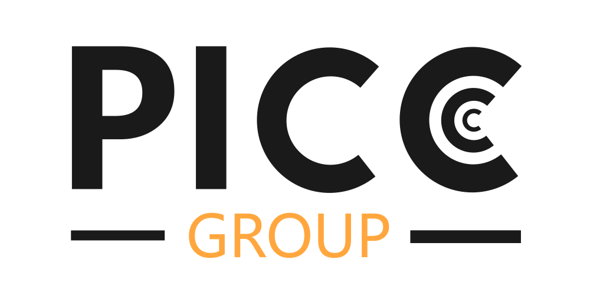

# Code for using NanoVNASaver without the GUI.
This project is a fork of the original [NanoVNASaver](https://github.com/NanoVNA-Saver/nanovna-saver) project, but without all the GUI parts. It is developed by The PICC Group at Lund University in the IEEE AP-S Student Design Contest.

## Setup
- Clone the repository: `git clone https://github.com/PICC-Group/nanovna-saver-headless.git`
- Run `pip3 install -r requirements.txt`
- Connect you NanoVNA to a USB-port.
- Run `python3 main.py`

## Tested hardware
This has only been tested on a LiteVNA (a cheap copy of the NanoVNA V2) but it should run on all VNAs supported by the original [NanoVNASaver](https://github.com/NanoVNA-Saver/nanovna-saver) project.

## Support for several VNAs
There is at the moment no support for multiple VNAs. But it is prepared for future support.

## Difference from NanoVNASaver
We have removed the entire graphical user interface and the only thing that is left of the NanoVNASaver code is the `Hardware` folder and the `Version.py` file (which has been moved to the Hardware folder). These are used to communicate with the NanoVNA. We have then added the file `NanoVNASaverHeadless.py` with the class `NanoVNASaverHeadless`.

### NanoVNASaverHeadless class
This class can be used in various projects where you want to control and get data streams from a NanoVNA. The idea is that it should be as minimal as possible and easy to use.

### The main.py script
This script is intended to be a demo of the usage of the NanoVNASaverHeadless class.

### The PICC Group
The PICC Group is a project in the 2024 IEEE AP-S Student Design Contest. 
[The PICC Group Website](https://picc-group.github.io)

##### Members
- Teo Bergkvist
- Otto Edgren
- Oscar Gren
- Måns Jacobsson
- Christian Nelson
- Dr. Johan Lundgren (Mentor)
